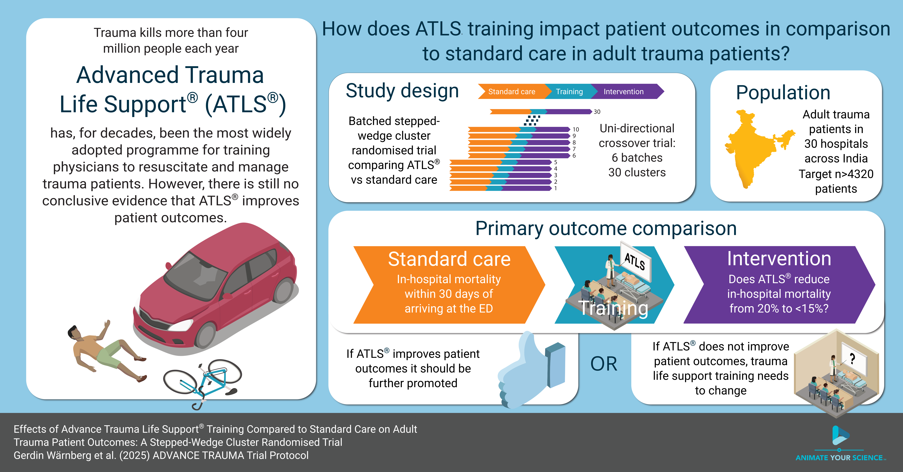

```{r setup}
#| echo: FALSE
#| cache: false

noacsr::source_all_functions()
attach(global_variables())
if (!isTRUE(knitr::is_latex_output()) && requireNamespace("flextable", quietly = TRUE)) {
  flextable::set_flextable_defaults(
    font.family = "EB Garamond",
    font.size = 8,
    theme_fun = flextable::theme_booktabs
  )
}
# Invalidate cached table chunks when the outcomes summary JSON changes.
knitr::opts_chunk$set(
  cache.extra = list(
    file.info("tables/outcomes-summary.json")$mtime,
    file.info("tables/cluster-rollout.csv")$mtime,
    file.info("tables/cluster-training.csv")$mtime
  )
)
```



<!-- github-issue-39: section labels everywhere; @sec- rendered as Title (Section N) via filters/sec-title-xref.lua. -->

# Administrative information {#sec-administrative-information}
## Study identifiers {#sec-study-identifiers}
```{r}
#| label: protocol-variables
#| echo: FALSE
#| cache: false

protocol.variables <- yaml::read_yaml("../protocol/_variables.yml")
```

-   Protocol version `r protocol.variables$version` dated `r protocol.variables$date`



## Changelog {#sec-changelog}
<!-- github-issue-11: changelog table only after version 1.0.0. -->
We will add a changelog here once we finalise version 1.0.0.

## Contributors {#sec-contributors}
| Name and ORCID                                                                  | Affiliation                              | Role                       |
|---------------------------------------------------------------------------------|------------------------------------------|----------------------------|
| Martin Gerdin Wärnberg (MGW) `r insert_orcid_link("0000-0001-6069-4794")`       | Karolinska Institutet                    | Principal Investigator     |
| Anna Olofsson (AO) `r insert_orcid_link("0000-0002-9460-108X")`                 | Karolinska Institutet                    | Statistician, TMG member   |
| Karla Hemming (KH) `r insert_orcid_link("0000-0002-2226-6550")`                 | University of Birmingham, Birmingham, UK | Statistician, TMG member   |
| James Martin (JM) `r insert_orcid_link("0000-0002-6949-4200")`                  | University of Birmingham, Birmingham, UK | Statistician               |
| Jessica Kasza (JK) `r insert_orcid_link("0000-0002-8940-0136")`                      | Monash University, Melbourne, Australia | Statistician               |
| Arpita Ghosh (AG) `r insert_orcid_link("0000-0003-0036-4376")`                      | The George Institute for Global Health, New Delhi, India | Statistician               |

```{=latex}
% Pandoc renders markdown tables as longtable, which increments the table counter
% even without a caption. This table should not count toward Table numbering.
\addtocounter{table}{-1}
```

<!-- sap-revision-todo J8 (GitHub #5): generative AI disclosure in administrative information. -->
## Use of generative artificial intelligence {#sec-use-of-generative-artificial-intelligence}
We used generative artificial intelligence tools, including large language models accessed via Cursor, to help draft, revise, and format this statistical analysis plan. We reviewed and approved all content, and we take full responsibility for the final document.



# Introduction {#sec-introduction}

## Visual abstract {#sec-visual-abstract}
```{r}
#| echo: false
#| label: fig-visual-abstract
#| fig.cap: "ADVANCE TRAUMA visual abstract."
#| fig.align: "center"
#| message: FALSE
#| warning: FALSE
#| out-width: "100%"


```

## Trial synopsis {#sec-trial-synopsis}




## Special considerations {#sec-special-considerations}




# Aim and objectives {#sec-aim-and-objectives}
## Aim {#sec-aim}
To compare the effects of ATLS^®^ training with standard care on outcomes in adult trauma patients.

## Objectives {#sec-objectives}
- To estimate the effects of ATLS^®^ training on 30-day in-hospital mortality compared with standard care.
- To assess, through sensitivity analyses, how robust the primary analysis results are to different model specifications, exposure definitions, and missing-data assumptions.
- To estimate the effects of ATLS^®^ training on secondary outcomes compared with standard care.
- To explore the effects of ATLS^®^ training on subgroups of patients compared with standard care.

## Framework {#sec-framework}
<!-- github-issue-13: CRT SAP reporting paper — clarify superiority framework plus statistical target of inference. -->
We have designed and will analyse the trial within a superiority framework, with ATLS^®^ training compared with standard care for the primary and secondary outcomes. We target a cluster-specific (conditional) intervention effect among eligible patient participants, not a marginal (population-averaged) effect and not an equal-weight average across clusters.

<!-- github-issue-12: reorder sections to Round Two checklist sequence. -->

# Study design {#sec-study-design}
## Trial design {#sec-trial-design}
<!-- sap-revision-todo D3 (comments id=3 MGW, id=4 AO; Round Two): confirm design descriptors including allocation and repeated measures on clusters. -->
This is a batched stepped-wedge cluster randomised trial with `r clusters` clusters (see @fig-trial-design). Each cluster is one hospital, and we randomise hospitals, even when we train more than one unit of physicians in the same hospital. There are two intervention conditions: ATLS^®^ training and standard care.

The trial comprises `r batches` batches of identical `r total.months`-period `r sequences`-sequence designs, with one cluster allocated to each sequence of each batch (equal allocation across sequences) [@Kasza2022]. Each period is one month, and each cluster will be in the trial for a total of `r total.months` months. We measure clusters repeatedly across periods. We will implement the intervention during a one-month transition period, which we exclude from the analysis. There will be an anticipated overlap of `r batches.overlap.months` months between successive batches.

Clusters will be sequentially allocated to batches based on when they enter the study, and within each batch clusters will then be randomised to an intervention implementation sequence. We include individual patients cross-sectionally for the primary outcome, although we assess some secondary outcomes at multiple follow-up time points. The anticipated trial period is from February 2025 to October 2029.

```{r}
#| echo: false
#| label: fig-trial-design
#| fig.cap: "Trial design. Each line shows how long we include patients in a cluster, by batch and sequence. Clusters will be sequentially allocated to a batch based on when they enter the study. Within each batch clusters will then be randomised to an intervention implementation sequence."
#| fig.align: "center"
#| message: FALSE
#| warning: FALSE

knitr::include_graphics(
  create_trial_design_flowchart(
    clusters = clusters, sequences = sequences, batches = batches,
    min.standard.care.months = min.standard.care.months,
    min.intervention.months = min.intervention.months,
    batches.overlap.months = batches.overlap.months,
    transition.months = transition.months,
    transition.overlap.months = transition.overlap.months,
    current.month = NULL,
    return.figure = FALSE,
    device = "png"
  )
)
```

Because certain secondary outcomes will be more burdensome to collect and because we anticipate larger effects on these outcomes, we will nest a staircase design within the main stepped-wedge design to measure these outcomes (see @fig-nested-staircase-design) [@grantham_staircase_2024]. The staircase design will include a random subset of patients presenting in the three months before and the three months after each cluster's scheduled transition period.

```{r}
#| echo: false
#| label: fig-nested-staircase-design
#| fig.cap: "Nested staircase design. We include a random subset of patients presenting in the three months before and the three months after each cluster's scheduled transition period."
#| fig.align: "center"
#| message: FALSE
#| warning: FALSE

knitr::include_graphics(
  create_trial_design_flowchart(
    clusters = clusters, sequences = sequences, batches = batches,
    min.standard.care.months = min.standard.care.months,
    min.intervention.months = min.intervention.months,
    batches.overlap.months = batches.overlap.months,
    transition.months = transition.months,
    transition.overlap.months = transition.overlap.months,
    staircase.months = staircase.months,
    return.figure = FALSE,
    device = "png"
  )
)
```

<!-- github-issue-75: shell of actual roll-out; phases in tables/cluster-rollout.csv, courses in tables/cluster-training.csv. -->
We will report the actual roll-out of the trial in the supplementary material (@fig-trial-rollout). For each cluster, the figure will show the planned periods of patient inclusion, the observed standard-care, transition, and intervention periods, and the dates of each ATLS^®^ training course.

## Intervention and control treatment {#sec-intervention-and-control-treatment}


## Randomisation and inclusion {#sec-randomisation-and-inclusion}
We will enrol and assign clusters to batches once eligibility is confirmed and ethical approval is obtained. Each batch will include hospitals from different regions to optimise trial logistics and training delivery.

We randomise clusters to sequences within each batch. Within each batch we balance allocation on cluster size, defined as the monthly volume of eligible patients, using covariate-constrained randomisation (CCR). We chose CCR to improve balance between intervention conditions on this key design variable.

In Batch 1, we randomised five clusters to five sequences using CCR. JM wrote an R program that listed all 120 possible allocations. For each allocation, the program calculated the squared difference in anticipated cluster size between the two intervention conditions. Because there was only one covariate, this squared difference was the balance score.

We excluded the 10% of allocations with the greatest imbalance and drew the final allocation at random from the remaining allocations. Because of limitations in the program, we calculated the balance score as if the design had no transition periods. We will repeat this CCR procedure independently for each remaining batch.

JM generates the random allocation sequence for each batch and sends it to the Trial Team so they can begin logistical arrangements, including securing places on upcoming ATLS^®^ training courses. We will conceal the allocation order from participating clusters for as long as is logistically feasible, because releasing physicians for training requires advance planning.

<!-- sap-revision-todo I4 (comments id=45 KH, id=46 AO): cross-ref nested staircase patient sampling. -->
We select patients for the nested staircase outcomes by random sampling stratified by shift, separately from cluster randomisation, see @sec-nested-staircase-design-and-secondary-outcomes.

## Sample size calculations {#sec-sample-size-calculations}
<!-- sap-revision-todo D4 (comments id=73 KH, id=74 AO, id=75 MGW): note design-phase Shiny CRT Calculator; no protocol cross-ref. -->
When we designed the trial, we calculated the sample size using the Shiny CRT Calculator [@Hemming2020Feb].

### Main stepped-wedge design and primary outcome {#sec-main-stepped-wedge-design-and-primary-outcome}


### Nested staircase design and secondary outcomes {#sec-nested-staircase-design-and-secondary-outcomes}


## Interim analysis {#sec-interim-analysis}


<!-- sap-revision-todo J4: content of the SDMC report after each batch, including the interim report (list only; detailed shells deferred). -->
The joint Trial Steering and Data Monitoring Committee (SDMC) will meet after each batch has completed the trial. For each meeting, the Trial Team will prepare a report, and the Trial Management Group will approve it before circulation. The report prepared after half of the batches have completed the trial is the interim analysis report. Each report will include:

- trial progress, overall, by batch and by intervention condition: the number of clusters included and dropping out, and the number of potentially eligible patients screened, patients included, patients who did not consent to out-of-hospital follow-up, and patients lost to follow-up
- adherence to the randomisation schedule and reasons for non-adherence
- summary statistics of included clusters and patient participants by intervention condition
- completeness of primary and secondary outcome data, overall and by intervention condition
- summary statistics of primary and secondary outcomes, pooled across intervention conditions and periods
- ATLS^®^ training delivery, including the number of physicians trained in each hospital
- protocol deviations and proposed protocol amendments
- safety events, as defined for SDMC monitoring
- relevant external evidence

We will not present or compare outcome values by intervention condition in these reports, to avoid biasing the SDMC or Trial Management Group. The SDMC will use each report to advise whether the trial remains feasible and should continue as planned.

<!--
Removed the recalculation of the sample size from the interim analysis after discussion with Karla and James on 2024-10-16. The rationale was that the estimates would be associated with so much uncertainty and that it wouldn't change things.

We will recalculate the sample size based on the observed period sizes and the observed effect size, using the Shiny CRT Calculator [@Hemming2020Feb]. In the revised sample size calculation, we will assume an ICC of 0.02, but consider sensitivity across the range 0.01-0.05 [@Campbell2005; @Eldridge2015], and a CAC of 0.9, but consider sensitivity across the range 0.8-1.0 [@Hemming2020Feb; @Martin2016; @Korevaar2021]. These assumptions are the same as in the original sample size calculation. -->

## Final analysis {#sec-final-analysis}
<!-- sap-revision-todo G2 (comment id=5 MGW; Round Two): single final analysis once all data are available. -->
We will analyse the primary and secondary outcomes together in a single final analysis once all trial data are available.

# Statistical principles {#sec-statistical-principles}
## Statistical hypotheses {#sec-statistical-hypotheses}
We will estimate the effect of ATLS^®^ training on 30-day in-hospital mortality compared with standard care, as an odds ratio (OR) and as an absolute risk difference (ARD). An OR < 1 or ARD < 0 indicates lower mortality among patients treated in hospitals after ATLS^®^ implementation than under standard care. Based on our pilot study and systematic review of the literature, we expect the intervention to reduce mortality.

## Levels of statistical significance and confidence {#sec-levels-of-statistical-significance-and-confidence}
We will use a two-sided significance level of 0.05 for all analyses, and we will report 95% confidence intervals (CI) for all estimates.

## Type I error control {#sec-type-i-error-control}
We will not adjust for multiple testing because we do not regard any secondary outcome as singularly more important. We will interpret the secondary outcomes together and not over-emphasise a single statistically significant result when the others appear unchanged.

<!-- sap-coherence-review (R2-03, R1 conflict 5): descriptive-summary conventions were stated three to five times each and had begun to drift; hoisted here because they govern tables in Trial sample, Intercurrent events, Effect measures and Safety events. -->
## Descriptive summaries {#sec-descriptive-summaries}
In every descriptive table we summarise discrete variables as frequencies and percentages, and continuous and count variables as medians and interquartile ranges (Q1–Q3). We report missing values for each variable, and we do not adjust any of these summaries for clustering. Where a table has a key version and a version with all variables, for example for patient characteristics, we present the key version in the main text and the full version in the supplementary material.

## Adherence and protocol deviations {#sec-adherence-and-protocol-deviations}
<!-- github-issue-21: draft adherence and protocol deviations from existing SAP/protocol text (checklist 17a/17b). -->

### Adherence to the intervention {#sec-adherence-to-the-intervention}
Adherence to the intervention is defined at the cluster and individual levels. It is distinct from the secondary outcome adherence to ATLS^®^ principles during initial patient resuscitation, see @sec-adherence-to-atls-principles-during-initial-patient-resuscitation. That outcome is not used to exclude patients from the primary analysis.

At the cluster level, adherence means that the cluster receives ATLS^®^ training during the transition period scheduled for its randomised sequence and does not implement ATLS^®^ training earlier. We will assess cluster-level adherence using the training log kept by the Trial Team. We will report the number and proportion of clusters that completed training as scheduled and the reasons for any non-adherence to the randomisation schedule. We also review adherence to the randomisation schedule in each report to the SDMC, see @sec-interim-analysis.

<!-- github-issue-69: classify patients by arrival at the emergency department, since eligible patients include those who die before admission and those transferred out from the emergency department. -->
At the individual level, exposure to the intervention is defined by the cluster's scheduled transition date, and patients are classified by the period in which they arrived at the emergency department, see @sec-analysis-sets. The primary analysis includes eligible patients irrespective of whether care was delivered by a trained physician.

### Protocol deviations {#sec-protocol-deviations}
A protocol deviation is any departure from the approved trial protocol, ICH-GCP, or applicable regulations. As stated in the protocol, we will report any serious breach or deviation to the sponsor without delay for assessment. A deviation is serious if it significantly affects, or is likely to affect, participant safety or integrity or the reliability of trial data. Minor deviations do not affect participant safety or integrity and do not materially affect the scientific value of the trial. We will document them in the trial records of the principal investigator and the sponsor.

We will summarise protocol deviations in each report to the SDMC and at the final analysis, overall and by intervention condition where informative. We will give counts by type, cluster-level or individual-level and serious or minor where classified, together with the reasons. We will not exclude clusters or patients from the primary analysis because of a deviation. Exposure is still defined by the scheduled transition date, see @sec-analysis-sets.

# Trial sample {#sec-trial-sample}
## Eligibility criteria {#sec-eligibility-criteria}
Our trial has eligibility criteria at the cluster and patient participant levels. We summarise them below, and the protocol gives full details.

### Cluster eligibility criteria {#sec-cluster-eligibility-criteria}


### Patient participant eligibility criteria {#sec-patient-participant-eligibility-criteria}


## Participant flow {#sec-participant-flow}
<!-- github-issue-22: two-figure CONSORT shells (cluster + patient), following batched SW reporting practice. -->
<!-- github-issue-20: nested-staircase patient flow reported separately from main CONSORT. -->

<!-- sap-revision-todo H3 (comment id=9 MGW; Round Two): stepped-wedge CONSORT extension for flow diagram. -->
We will use CONSORT diagrams to show the flow of clusters and patients through the main batched stepped-wedge trial. In line with recent batched stepped-wedge practice [@escp_eagle_2024], we will present two figures in the main text: a cluster-level diagram (@fig-consort-clusters) and a patient-level diagram (@fig-consort-patients). For each sequence, the diagrams will report the numbers randomised or included, losses and exclusions after randomisation with reasons, and the numbers analysed for the primary outcome. The patient diagram will also show flow before and after ATLS^®^ training.

A separate figure in the supplementary material will show flow for the nested-staircase outcomes, which are adherence to ATLS^®^ principles, EQ-5D-5L, and WHODAS 2.0 (@fig-consort-nested-staircase). It will show patients in the staircase periods, losses and exclusions, and the numbers analysed, by sequence, before and after ATLS^®^ training, and overall.

We will report the trial according to the CONSORT extension for stepped-wedge cluster randomised trials [@Hemming2018].

## Baseline characteristics {#sec-baseline-characteristics}
### Cluster characteristics {#sec-cluster-characteristics}
<!-- sap-revision-todo J7: non-floating longtable so placement stays in document order. -->
<!-- github-issue-14: add state to cluster characteristics shell. -->
<!-- github-issue-72: state whether the shell is intended for the main text or the supplementary material. -->
We will describe cluster characteristics, including state and size, as specified under @sec-descriptive-summaries. The state categories depend on the final set of participating clusters. We will present these characteristics in the main text (@tbl-cluster-characteristics).

### Patient characteristics {#sec-patient-characteristics}
<!-- sap-revision-todo E1 (comments id=166 KH, id=167 AO): all eligible patients over entire trial; baseline = characteristics not outcomes. -->
<!-- sap-revision-todo J7: non-floating longtable so placement stays in document order. -->
We will describe the characteristics of all eligible patients over the entire trial period, before and after ATLS^®^ training and overall, as specified under @sec-descriptive-summaries. Baseline characteristics do not include outcome variables. We will present key characteristics in the main text (@tbl-patient-characteristics) and all characteristics in the supplementary material (@tbl-patient-characteristics-all).

# Outcomes {#sec-outcomes}
## Outcomes {#sec-outcomes-overview}
<!-- github-issue-67: point readers from the outcomes summary table to the strategy definitions. -->
@tbl-outcomes-summary summarises all outcomes with their populations, effect measures, and handling of intercurrent events. The strategies named in the last column of that table are defined under @sec-strategies-for-handling-intercurrent-events.

<!-- sap-revision-todo C1 (comments id=55, id=56 KH; id=57, id=58 AO/MGW; Round Two id=11): death/transfer ICE per outcome; primary includes deaths after transfer. -->


```{r}
#| label: outcomes-table-data
#| include: false

outcomes.table <- jsonlite::fromJSON("tables/outcomes-summary.json")

names(outcomes.table) <- c(
  "Outcome",
  "Design component",
  "Data type",
  "Population",
  "Main analysis model",
  "Effect measure",
  "Potential intercurrent events",
  "Strategy for handling intercurrent events"
)
```

```{=openxml}
<w:p><w:pPr><w:pStyle w:val="word-landscape-start" /></w:pPr></w:p>
```

```{r}
#| label: tbl-outcomes-summary
#| tbl-cap: "Summary of outcomes, populations, effect measures, and handling of intercurrent events. The strategies named in the last column are defined in the section Strategies for handling intercurrent events."
#| echo: false
#| message: false
#| warning: false
#| results: asis
ncol.outcomes <- ncol(outcomes.table)
# Column widths sum to 0.84\\linewidth so tabcolsep does not overflow the text block
col.widths <- c(0.20, 0.08, 0.07, 0.09, 0.13, 0.08, 0.10, 0.09)

if (isTRUE(knitr::is_latex_output())) {
  col.align <- sprintf("p{%s\\linewidth}", col.widths)
  outcomes.kable <- knitr::kable(
    outcomes.table,
    format = "latex",
    booktabs = TRUE,
    longtable = TRUE,
    align = col.align
  ) |>
    kableExtra::kable_styling(
      latex_options = c("repeat_header"),
      font_size = 8
    )

  # kableExtra repeat_header uses the wrong colspan for p{} column alignments
  outcomes.latex <- as.character(outcomes.kable)
  outcomes.latex <- gsub(
    sprintf("\\\\multicolumn\\{%d\\}", ncol.outcomes * 2 - 2),
    sprintf("\\\\multicolumn{%d}", ncol.outcomes),
    outcomes.latex
  )

  # Margins for the landscape table pages. Because pdflscape rotates the page,
  # geometry's top/bottom control the VISUAL left/right (the long edge) and
  # left/right control the VISUAL top/bottom. \newgeometry must come BEFORE
  # \begin{landscape} so the landscape text block is built from these margins.
  cat("\\newgeometry{top=2cm,bottom=2cm,left=2cm,right=2cm}\n")
  cat("\\begin{landscape}\n")
  cat("\\setlength{\\tabcolsep}{3pt}\n")
  cat("\\setlength{\\LTleft}{\\fill}\n")
  cat("\\setlength{\\LTright}{\\fill}\n")
  cat(outcomes.latex)
  cat("\\end{landscape}\n")
  cat("\\restoregeometry\n")
} else if (requireNamespace("flextable", quietly = TRUE)) {
  # Landscape text width of an A4 page with 2 cm margins, in inches
  landscape.width <- 10.08
  outcomes.flextable <- flextable::flextable(outcomes.table) |>
    flextable::font(fontname = "EB Garamond", part = "all") |>
    flextable::fontsize(size = 8, part = "all") |>
    flextable::theme_booktabs() |>
    flextable::align(align = "left", part = "all") |>
    flextable::width(width = landscape.width * col.widths / sum(col.widths))
  knitr::knit_print(outcomes.flextable)
} else {
  knitr::kable(outcomes.table)
}
```

```{=openxml}
<w:p><w:pPr><w:pStyle w:val="word-landscape-end" /></w:pPr></w:p>
```

# Intercurrent events, populations and summary measures {#sec-intercurrent-events-populations-and-summary-measures}
## Intercurrent events {#sec-intercurrent-events}
<!-- github-issue-23: draft ICE strategies from outcomes-summary table and existing outcome analysis text. -->
Intercurrent events are patient-level events after intervention exposure that affect the occurrence or interpretation of an outcome. @tbl-outcomes-summary lists the anticipated events and the handling strategy for each outcome.

We will report each event as the count and percentage of patients with the event before the outcome was assessed, before and after ATLS^®^ training and overall, see @sec-descriptive-summaries. Denominators are the primary analysis set or the nested sample before any outcome-specific restriction, so that events that remove a patient from an analysis set are still counted. We will present these summaries in the supplementary material (@tbl-intercurrent-events).

At the cluster level, we treat early or late transition, incomplete delivery of ATLS^®^ training, and cluster dropout as adherence or protocol issues rather than intercurrent events, see @sec-adherence-and-protocol-deviations. They do not change how exposure is defined, see @sec-analysis-sets.

At the individual level, the intervention is training of hospital staff, so patients cannot discontinue or withdraw from it. The anticipated patient-level intercurrent events are:

<!-- github-issue-23: transfer is part of the mortality outcome definitions, not an ICE. -->
<!-- sap-revision-todo C1 (comments id=55, id=56 KH; id=57, id=58 AO/MGW; Round Two id=11): death/transfer relevance for length of stay and ICU admission stated here; handling defined once under Strategies. -->
- **Transfer to another hospital.** Relevant to length of emergency department, hospital, and intensive care unit (ICU) stay and to ICU admission. Transfer is not an intercurrent event for mortality outcomes, because the primary outcome includes in-hospital deaths after transfer and all-cause mortality counts deaths in any setting.
<!-- github-issue-23: death as ICE is death before that outcome's assessment. -->
- **Death.** Death is an intercurrent event only for outcomes assessed after it. For length of stay and ICU admission it is handled in the same way as transfer, see @sec-strategies-for-handling-intercurrent-events. Quality of life, disability, and return to work are defined only among patients alive at the relevant follow-up.
- **Withdrawal of consent for non-routine data collection.** Relevant to outcomes that need opt-in follow-up, namely return to work, quality of life, disability, and all-cause mortality when not available from records. It is not relevant to the primary outcome, length of stay, ICU admission, or adherence, which are collected under opt-out consent. Patients who withdraw contribute outcomes observed before withdrawal unless they also ask for their data to be removed. Missing values are handled under @sec-missing-data.
- **Loss to follow-up.** Relevant to the same outcomes as withdrawal, and to the primary outcome for patients transferred to another hospital. Missing values are handled under @sec-missing-data.
<!-- Observation window is a ceiling, not a minimum: resuscitation ending early (ED exit or death) completes the observation and unperformed items count as non-adherence. -->
- **Incomplete observation of resuscitation.** Relevant only to ATLS^®^ adherence. We score the checklist by observing the initial resuscitation until it ends or until one hour after the physician first sees the patient, whichever comes first. Items not completed by then count as not adhered to, including when the patient leaves the emergency department or dies before one hour. Observation is incomplete only when the observer could not follow the resuscitation to that point, for example because the observer arrived late or was interrupted. We exclude unobserved and incompletely observed resuscitations from the adherence analysis.

### Strategies for handling intercurrent events {#sec-strategies-for-handling-intercurrent-events}
<!-- github-issue-67: define the strategy labels used in the last column of the outcomes summary table. -->
We define the strategies below in the order in which they first appear in @tbl-outcomes-summary. Where the table lists two strategies for an outcome, the second applies to any event not covered by the first.

- **Missing data.** The outcome is not observed. Under the available-case approach we exclude these observations from the analysis of that outcome, and under multiple imputation we impute them, see @sec-missing-data.
- **Observed stay truncated by death or transfer.** The length of stay is the completed duration until the patient leaves the unit, including when the patient leaves by dying or being transferred. These stays enter the analysis at their observed value and are not censored.
- **Classified by whether ICU admission occurred first.** Patients who die or are transferred count as admitted to intensive care only if the admission occurred before that event. The outcome is therefore defined for every patient in the analysis set.
- **While-alive.** The outcome is defined only among patients alive at the assessment time point. The estimated effect applies to survivors at that time point, and mortality is analysed separately.
- **Available-case in the observed nested sample.** The outcome is analysed among completely observed resuscitations, see @sec-intercurrent-events. Unobserved and incompletely observed resuscitations are excluded.

Where we use a while-alive strategy, we assume that death before the outcome assessment does not cause selection bias beyond what the separate analysis of mortality addresses. We will interpret the results for survivor outcomes together with the results for mortality. We will consider the assumptions behind each strategy when we interpret the results and check model assumptions, see @sec-analysis-methods.

<!-- github-issue-23: ICE frequency shell grouped by outcome and applicable events. -->

## Population {#sec-population}
<!-- github-issue-24: draft target populations from analysis-set and eligibility text. -->
<!-- github-issue-69: define population and analysis set where populations are introduced. -->
<!-- Round Two checklist items 23, 24 and 26 (AO/MGW); sap-revision-todo H4: populations defined here and named in @tbl-outcomes-summary; analysis sets reduced to one general rule under @sec-analysis-sets. -->
A population is the group of patients to which an estimated effect applies. An analysis set is the set of observations that enter a given analysis, as defined under @sec-analysis-sets. @tbl-outcomes-summary names the population for each outcome.

- **Trauma patients.** Patients aged 15 years or older who present to the emergency department with trauma requiring admission. This is the population for the primary outcome, all-cause mortality, length of emergency department and hospital stay, ICU admission, and adherence to ATLS^®^ principles.
- **Trauma patients admitted to ICU.** The population for length of ICU stay.
- **Trauma patients alive at follow-up.** Trauma patients who were alive when the outcome was assessed, within seven days of discharge, at 30 days, or at three months after arrival at the emergency department. These are the populations for quality of life and disability.
- **Trauma patients alive at follow-up and working at inclusion.** Trauma patients who were alive at 30 days or at three months after arrival at the emergency department and who were working at the time of inclusion. Working means paid or unpaid work, studying or keeping house. These are the populations for return to work.

## Analysis sets {#sec-analysis-sets}
<!-- sap-revision-todo H4 (comments id=12 MGW, id=13 AO; Round Two): specify target population per analysis including LOS/ICU and nested survivors. -->
<!-- github-issue-24: keep operational analysis-set rules here; target populations moved above. -->
<!-- github-issue-69: define the observation, the exposure rule, and every analysis set named in the outcomes summary table. -->
An observation is one presentation by an eligible patient to the emergency department of a participating cluster. It belongs to the cluster the patient presented to and to the period in which the patient arrived. An observation is exposed to the intervention if the patient arrived after the period in which the cluster was scheduled to transition, and to standard care otherwise, irrespective of when the cluster was in fact trained or who delivered the care, see @sec-adherence-and-protocol-deviations and @sec-exposure-defined-by-the-actual-date-of-transition.

<!-- Round Two checklist item 24 (AO/MGW): three named sets; the first retains the protocol wording (protocol.qmd, Statistics, General principles). -->
- **Primary analysis set.** All randomised clusters and all eligible patients, that is all observations within clusters with available data, irrespective of the receipt of the intervention, with the exception of the transition periods. A cluster that leaves the trial early, or is still in the trial when the trial stops, contributes the periods it completed. Used for the outcomes collected in the main stepped-wedge design.
- **Nested sample.** The observations for the patients randomly selected for nested staircase data collection, see @sec-nested-staircase-design-and-secondary-outcomes. Used for quality of life and disability.
- **Observed nested sample.** The observations in the nested sample with a completely observed resuscitation, see @sec-intercurrent-events. Used for adherence to ATLS^®^ principles.

Each analysis includes the observations in its analysis set that belong to the population of the outcome and have an observed outcome value. Under multiple imputation, observations with a missing outcome are retained and imputed, see @sec-missing-data. Adjusted available-case analyses include only observations with complete adjustment covariates.

## Effect measures {#sec-effect-measures}
<!-- github-issue-25: revise effect measures against checklist; keep descriptive shells and cross-ref analysis shells. -->
<!-- sap-revision-todo J1: key vs all descriptive outcome shell tables (domain-level EQ-5D-5L in supplementary). -->
Outcomes are measured on individual patients. We will summarise the primary and secondary outcomes before and after ATLS^®^ training and overall, as specified under @sec-descriptive-summaries. We will present key outcomes in the main text (@tbl-outcomes-descriptive) and all outcomes in the supplementary material (@tbl-outcomes-descriptive-all).

<!-- github-issue-13: CRT SAP reporting paper — participant-level vs cluster-average; cluster-specific vs marginal. -->
<!-- sap-revision-todo H1 (comments id=14, id=15, id=17 MGW/AO; Round Two): effect measures by outcome type; no HR after A2; cluster-specific estimates. -->
@tbl-outcomes-summary lists the comparative effect measure for each outcome. We estimate them from the mixed-effects models described under @sec-analysis-methods. These models give cluster-specific (conditional) estimates of the intervention effect, not marginal (population-averaged) estimates. The target is an average over patients rather than over clusters, see @sec-framework. The effect measures by outcome type are:

- **Dichotomous outcomes:** odds ratio from a binomial model with a logit link, and absolute risk difference from a binomial model with an identity link.
- **Count (length-of-stay) outcomes:** rate ratio from a negative binomial model with a log link.
- **Ordinal outcomes (EQ-5D-5L domains):** cumulative odds ratio from a cumulative logit model.
- **Continuous outcomes (EQ-5D-5L VAS and WHODAS 2.0 summary score):** mean difference from a linear mixed model.
- **Adherence proportion:** difference on the logit scale from a beta regression model.

# Analysis methods {#sec-analysis-methods}
<!-- github-issue-26: replace checklist placeholder with overview pointing to existing subsections. -->
<!-- github-issue-70: state the general estimation specifications once here, instead of repeating them under the primary outcome. -->
We will analyse the primary and secondary outcomes with mixed-effects regression models that account for clustering at the hospital level. The link function and outcome distribution depend on the data type of each outcome, and the subsections below specify the model for each outcome.

<!-- sap-revision-todo A4 (comments id=102 KH, id=103 AO); github-issue-69: moved here from Analysis sets, next to the model specification it justifies. -->
Randomisation is at the hospital level, and all participating units within a hospital belong to the same cluster. The models therefore include a random effect at the hospital level and no separate random effect for unit within hospital.

<!-- sap-revision-todo A1 (comments id=199 KH, id=200 AO); B4 (comment id=23 AO; Round Two 27b): general estimation framework is ML with Laplace; package/implementation not prespecified. -->
Unless stated otherwise, the following specifications apply to all analyses in this section. We will estimate the models by maximum likelihood, using a Laplace approximation to integrate over the random effects. Linear mixed models are the exception, and we will estimate them by restricted maximum likelihood (REML), which the Kenward–Roger correction requires. We do not prespecify the R package or numerical implementation, see @sec-statistical-software.

<!-- sap-revision-todo B3 (comments id=21, id=22 AO; Round Two 27c/27d): model-based SEs, small-sample adjustments, Wald-type CIs. -->
Standard errors will be model-based, and confidence intervals will be Wald-type. Because the trial has few clusters, we will apply a small-sample correction to avoid inflating the type I error rate. For linear mixed models, we plan to use the Kenward–Roger correction [@grantham_evaluating_2022]. Small-sample corrections for binomial and other non-linear mixed models are an area of active research, so we will choose the correction for these models closer to the end of patient inclusion, based on the best available evidence at that time. The correction may also differ between outcomes collected in the complete stepped-wedge design and in the incomplete nested staircase design.

<!-- sap-revision-todo B2 (comments id=24 MGW, id=25 AO; Round Two): state that diagnostics will check distributional assumptions and convergence. -->
We will use model diagnostics to check distributional assumptions and model convergence.

## Analysis of the primary outcome {#sec-analysis-of-the-primary-outcome}
The primary outcome is in-hospital mortality within 30 days of arrival at the emergency department, which we will analyse as a dichotomous variable. We will estimate the OR and the ARD of death under ATLS^®^ compared with standard care.

<!-- sap-revision-todo B8 (comment id=20 AO; Round Two 27a): confirm hospital-level clustering, outcome-appropriate links, and cluster-specific intervention effect. -->
<!-- github-issue-13: CRT SAP reporting paper — time-averaged (common) SW intervention effect vs period-specific effects. -->
We will use a mixed-effects binomial regression model with a logit link to estimate the OR and with an identity link to estimate the ARD. Our primary estimand is a single intervention effect that is assumed constant across all periods of ATLS^®^ exposure, rather than separate effects for each period after transition. We will fit a prespecified sequence of models of decreasing complexity and report the most complex model that converges. We move to a simpler model only if we meet convergence or numerical stability problems. If the model with the logit link converges but the model with the identity link does not, we will report only an OR.

All models in the sequence include a fixed effect for intervention exposure and adjust for time. Later models simplify the parametrisation of time, the random effects structure, or both.

The model sequence is defined as follows:

1. **Primary model**: a model with categorical fixed effects for period, estimated separately for each batch, and a fixed effect for intervention exposure. The model accounts for clustering with a random intercept for cluster and a random cluster-by-period effect, both normally distributed (@eq-primary-model).

$$
g\{\Pr(Y_{bkti} = 1)\} = \mu + \beta_{bt} + \theta X_{bkt} + \alpha_{bk} + \gamma_{bkt}
$$ {#eq-primary-model}

2. **Simplified random effects structure**: the primary model without the random cluster-by-period effect, so that clustering is modelled by a random intercept for cluster only (@eq-simplified-random-effects-model).

$$
g\{\Pr(Y_{bkti} = 1)\} = \mu + \beta_{bt} + \theta X_{bkt} + \alpha_{bk}
$$ {#eq-simplified-random-effects-model}

<!-- sap-revision-todo B1 (comments id=191 KH, id=192 AO): state retained random effects and batch indexing for the shared period effects model. -->
<!-- Shared period effects are calendar-month effects (48 months in the design matrix), not a within-batch period index shared across batches; see JK's note below eq-beta-model. -->
3. **Model with shared period effects**: the primary model with categorical fixed effects for calendar month instead of separate period effects for each batch. Batches share the effects of the months in which they overlap. Alternatively, calendar time may be modelled directly, for example as a continuous covariate or with splines. The model keeps the random intercept for cluster and the random cluster-by-period effect, and clusters remain indexed by batch (@eq-shared-period-model).

$$
g\{\Pr(Y_{bkti} = 1)\}
= \mu + \beta_{c(b,t)} + \theta X_{bkt} + \alpha_{bk} + \gamma_{bkt}
$$ {#eq-shared-period-model}

4. **Combined simplified model**: a model with shared period effects and a random intercept for cluster only. This is the simplest model we consider acceptable for the primary analysis (@eq-combined-simplified-model).

$$
g\{\Pr(Y_{bkti} = 1)\}
= \mu + \beta_{c(b,t)} + \theta X_{bkt} + \alpha_{bk}
$$ {#eq-combined-simplified-model}

Where:

- $g(\cdot)$: the link function, specified as either the logit link, $g(p) = \log\{p/(1-p)\}$, or the identity link, $g(p) = p$, depending on the estimand of interest.
- $\Pr(Y_{bkti} = 1)$: the probability of death for patient $i = 1, \dotsc, m_{bkt}$ in cluster $k$ during period $t = 1, \dotsc, `r total.months`$ in batch $b$. The planned design has `r batches` batches of `r clusters / batches` clusters, giving `r clusters` clusters in total. A cluster that completes the trial contributes `r total.months - transition.months` periods, because its transition period is excluded.
- $m_{bkt}$: the number of patients in cluster $k$ during period $t$ in batch $b$.
- $\mu$: the intercept, representing the value of the linear predictor for the reference levels of all fixed effects, with random effects equal to zero.
- $\beta_{bt}$: the fixed effect of period $t$ in batch $b$, with one effect for each period of each batch. The planned design has `r batches` $\times$ `r total.months` = `r batches * total.months` period effects.
- $\beta_{c(b,t)}$: the fixed effect of calendar month $c(b,t)$, the month of the trial in which period $t$ of batch $b$ falls. Batches share the effects of the months in which they overlap, so there is one effect for each calendar month of the trial. The number of calendar months depends on when each batch starts and is `r batches * total.months - (batches - 1) * batches.overlap.months` in the planned design.
- $\theta$: **the intervention effect**, the fixed effect of intervention exposure and the primary estimand. Under the logit link, $\theta$ is the log odds ratio for death under ATLS^®^ compared with standard care. Under the identity link, it is the absolute risk difference.
- $X_{bkt}$: the intervention exposure indicator for cluster $k$ during period $t$ in batch $b$, with $X_{bkt} = 1$ for ATLS^®^ and $X_{bkt} = 0$ for standard care.
- $\alpha_{bk}$: a normally distributed random effect for cluster $k$ in batch $b$, representing between-cluster (hospital-level) variability in the outcome.
- $\gamma_{bkt}$: a normally distributed random effect for cluster $k$ in period $t$ in batch $b$, representing within-cluster variation over time and capturing cluster-specific deviations from the average period effect.

The distributional assumptions for the random effects are specified in @eq-distributional-assumptions.

$$
\begin{aligned}
\alpha_{bk} &\overset{\text{iid}}{\sim} \mathcal{N}(0,\sigma^2_{\alpha}), \\
\gamma_{bkt} &\overset{\text{iid}}{\sim} \mathcal{N}(0,\sigma^2_{\gamma}), \\
\alpha_{bk} &\perp \gamma_{bkt}.
\end{aligned}
$$ {#eq-distributional-assumptions}

## Analysis of secondary outcomes {#sec-analysis-of-secondary-outcomes}
<!-- github-issue-15 github-issue-70: keep only ordinal-specific diagnostics here; general diagnostics in the overview. -->
<!-- sap-revision-todo B2 (comments id=24 MGW, id=25 AO; Round Two): diagnostics for secondary models, including proportional odds for ordinal outcomes. -->
<!-- sap-revision-todo H1 (comments id=14, id=15, id=17 MGW/AO; Round Two): effect measures by outcome type; no HR after A2; cluster-specific estimates. -->
<!-- github-issue-71: carry over the primary-analysis model specification instead of repeating the convergence sequence for every secondary outcome. -->
Unless stated otherwise, we will analyse each secondary outcome with the period parametrisation and random effects structure of the model selected for the primary analysis under @sec-analysis-of-the-primary-outcome. The link function and outcome distribution are chosen to suit each outcome, with the effect measures listed under @sec-effect-measures. We will not repeat the model sequence for each secondary outcome. If the selected model does not converge for a secondary outcome, we will continue down the same sequence for that outcome. We will report which model we used for each outcome. For outcomes collected in the nested staircase design, period effects are calendar-month effects shared across batches, as in the model with shared period effects, rather than separate effects for each batch. The random effects structure still follows the primary analysis.

For cumulative logit models, we will also check the proportional odds assumption.

### All-cause mortality within 24 hours, 30 days and three months of arrival at the emergency department {#sec-all-cause-mortality-within-24-hours-30-days-and-three-months-of-arrival-at-the-emergency-department}
<!-- github-issue-71: use the binomial model selected for the primary analysis rather than a fixed reference to @eq-primary-model. -->
We will analyse these outcomes as dichotomous variables with the binomial model selected for the primary analysis, with the logit and identity links, to estimate ORs and ARDs.

### Quality of life within seven days of discharge, and at 30 days and three months of arrival at the emergency department, among survivors {#sec-quality-of-life-within-seven-days-of-discharge-and-at-30-days-and-three-months-of-arrival-at-the-emergency-department-among-survivors}
<!-- sap-revision-todo C6 (comments id=295, id=296 KH/AO; id=303 KH): clarify EQ-5D-5L yields ordinal domains plus VAS. -->
<!-- sap-revision-todo C7 (Anna email): standardise instrument name to EQ-5D-5L in SAP text. -->
We measure quality of life within the nested staircase design, using the official and validated translations of the EQ-5D-5L. The EQ-5D-5L gives two outcome types: five ordinal domain scores (mobility, self-care, usual activities, pain/discomfort, and anxiety/depression), each rated on a Likert scale from 1 to 5, and a visual analogue scale (VAS) ranging from 0 to 100.

For each of the five ordinal domains, we will use a mixed-effects cumulative logit (proportional odds) model:

$$
\text{logit}\{\Pr(Y_{bkti} \leq j)\}
= \mu_j + \beta_{c(b,t)} + \theta X_{bkt} + \alpha_{bk} + \gamma_{bkt}
$$ {#eq-ordinal-model}

Where $\mu_j$ is the intercept for category $j$, and all other terms are defined as in the primary analysis model.

The VAS will be analysed as a continuous outcome using a linear mixed-effects model:

$$
\text{VAS}_{bkti}
= \mu + \beta_{c(b,t)} + \theta X_{bkt} + \alpha_{bk} + \gamma_{bkt} + \epsilon_{bkti},
\quad \epsilon_{bkti} \sim \mathcal{N}(0,\sigma^2)
$$ {#eq-linear-model}

### Disability within seven days of discharge, and at 30 days and three months of arrival at the emergency department, among survivors {#sec-disability-within-seven-days-of-discharge-and-at-30-days-and-three-months-of-arrival-at-the-emergency-department-among-survivors}
<!-- WHODAS 2.0 is the 12-item version (CRF items S1–S12); domain scores are not reliable with two items per domain, so only the summary score is analysed. -->
We measure disability within the nested staircase design using the 12-item version of the WHO Disability Assessment Schedule 2.0 (WHODAS 2.0) [@ustun_measuring_2010]. It covers six domains of functioning: cognition, mobility, self-care, getting along, life activities, and participation. Each item is rated from 1 (no difficulty) to 5 (extreme difficulty or cannot do). We will calculate a summary score from 0 to 100 using the WHODAS 2.0 "complex scoring" method, and we will not calculate domain scores. We will analyse the summary score with a linear mixed-effects model (@eq-linear-model).

### Return to work at 30 days and three months after arrival at the emergency department, among survivors {#sec-return-to-work-at-30-days-and-three-months-after-arrival-at-the-emergency-department-among-survivors}
<!-- github-issue-10: align RTW with binary OR and ARD (same as primary mortality). -->
<!-- github-issue-18: use converged primary-analysis model, not a hard-coded @eq-primary-model. -->
We will analyse return to work as a dichotomous outcome with the binomial model selected for the primary analysis, with the logit and identity links, to estimate ORs and ARDs.

<!-- sap-revision-todo A2 (comments id=349, id=350 KH; id=351 AO; id=348 AO): replace Fine–Gray competing-risks LOS models with mixed-effects negative binomial count models; clarify purpose, random/period effects, and death/transfer handling. -->
<!-- sap-revision-todo C2 (comment id=348 AO): ED stay defined as hours to ED exit; exit routes enumerated; all routes contribute observed duration. -->

### Length of emergency department stay {#sec-length-of-emergency-department-stay}
We will analyse length of emergency department stay as a count outcome: the number of hours from arrival at the emergency department (ED) until ED exit. Exit may occur via ward admission, ICU admission, transfer to another hospital, death, or discharge home. All of these routes contribute the observed ED duration. We will estimate the effect of ATLS^®^ training on mean ED length of stay. We analyse mortality separately as a primary and secondary outcome rather than as a competing event.

<!-- github-issue-19: preferred LOS model with same convergence sequence as primary. -->
<!-- github-issue-71: period and random effects structure carried over from the primary analysis. -->
The model is a mixed-effects negative binomial regression with a log link and a fixed effect for intervention exposure. @eq-length-of-stay-model shows the model with the structure of the primary model. If a simpler structure was selected for the primary analysis, we use that structure instead. The intervention effect $\theta$ is the log rate ratio for ED length of stay under ATLS^®^ compared with standard care, and we will report the rate ratio $\exp(\theta)$.

$$
\log\{\mathbb{E}(Y_{bkti})\}
= \mu + \beta_{bt} + \theta X_{bkt} + \alpha_{bk} + \gamma_{bkt}
$$ {#eq-length-of-stay-model}

Where $Y_{bkti}$ is the length-of-stay count for patient $i$ in cluster $k$ during period $t$ in batch $b$, and all other terms are defined as in the primary analysis model. The negative binomial model also estimates a dispersion parameter.

### Length of hospital stay {#sec-length-of-hospital-stay}
We will analyse length of hospital stay as a count outcome: the number of days from arrival at the emergency department until the patient leaves the hospital by discharge, transfer, or death. The analysis uses the same negative binomial model as for ED length of stay (@eq-length-of-stay-model).

### Intensive care unit admission {#sec-intensive-care-unit-admission}
<!-- github-issue-10: align ICU admission with binary OR and ARD (same as primary mortality). -->
We will analyse ICU admission as a dichotomous outcome with the binomial model selected for the primary analysis, with the logit and identity links, to estimate ORs and ARDs. Patients who die or are transferred count as admitted only if ICU admission occurred before that event.

### Length of intensive care unit stay {#sec-length-of-intensive-care-unit-stay}
We will analyse length of ICU stay as a count outcome among patients admitted to ICU: the number of days from ICU admission until the patient leaves the ICU by discharge, transfer, or death. The analysis uses the same negative binomial model as for ED length of stay (@eq-length-of-stay-model).

### Adherence to ATLS^®^ principles during initial patient resuscitation {#sec-adherence-to-atls-principles-during-initial-patient-resuscitation}
<!-- sap-revision-todo C3 (comment id=361 KH): checklist assessed in both standard-care and ATLS^®^ periods. -->
<!-- sap-revision-todo C4 (comments id=61 KH, id=62 AO, id=63 MGW): express adherence as percentage; 14/14 = 100%; duplicate paragraph already removed. -->
We assess adherence to ATLS^®^ principles within the nested staircase design, in both the standard care and the ATLS^®^ periods. Adherence is the percentage of completed items on a 14-item checklist that covers the key steps of the ATLS^®^ primary survey, so completing all 14 items is 100% adherence. We will convert the percentage to a proportion between 0 and 1 and analyse it with a mixed-effects beta regression model with a logit link:

$$
\text{logit}\{\mathbb{E}(Y_{bkti})\}
= \mu + \beta_{c(b,t)} + \theta X_{bkt} + \alpha_{bk} + \gamma_{bkt}
$$ {#eq-beta-model}

Where $\mathbb{E}(Y_{bkti})$ is the expected adherence proportion, and $\theta$ is the difference in expected adherence proportion on the logit scale. The beta distribution excludes 0 and 1, so we will transform observed proportions to lie in the open interval $(0,1)$ before fitting the model. The model also estimates a precision (dispersion) parameter.

<!--
*Question:** Should we adjust for calendar time because the last batch will be two years later than the first batch?

JK: Would this be instead of the beta_bt terms? That is, instead of separate period effects for each batch, just terms for each period would be included? (This is related to the question about 78 parameters in the model). The separate period effects for each batch will adjust for the calendar time. This is the model that makes the fewest assumptions about the period effects.

We've done a bit of work recently which shows that if there are separate period effects in each batch but instead shared period effects are included, this can lead to quite a lot of bias in the estimation of the treatment effect. This work also seems to indicate that when separate period effects are included but the period effects are actually shared, this doesn't really have any deleterious impacts on the inference for the treatment effect. (However note that parameterisation of time wasn't the focus of the work we've done).

So my recommendation would be for the primary analysis to be as currently specified (separate period effects for each batch); then if there are issues with fitting that model, try a model with calendar time (i.e. period effects shared when there is overlap between successive batches).

**Question:** Just a thought: keep in mind the complexity of the random effects structure; if it leads to convergence problems or overfitting, should we consider simplifying the random effects?

-->

## Correlations {#sec-correlations}
<!-- github-issue-26: move ICC/correlation reporting here from primary-analysis subsection (B5–B6). -->
<!-- sap-revision-todo B5 (comments id=26, id=27 AO; Round Two): report time-adjusted within-cluster correlations, variance components, and latent-scale correlations (protocol-aligned). -->
<!-- sap-revision-todo J6 (amended, sap-coherence-review R1-22): latent-scale reporting is additional for binary and ordinal outcomes. -->
We will report time-adjusted within-cluster correlations for all outcomes with 95% CIs, including the intra-cluster correlation (ICC) and within- and between-period correlations implied by the assumed correlation structures, together with all estimated variance components. For binary and ordinal outcomes we will also report these correlations on the latent scale. For continuous outcomes the latent and observed scales are the same.

<!-- sap-revision-todo B6 (comments id=28, id=29 AO; Round Two): ICC and related correlations derived from variance components; AR(1) rho from the AR(1) structure. -->
We will derive the correlations from the estimated variance components of the fitted models. For models with an AR(1) within-cluster structure, we will estimate the correlation parameter directly from that structure. We will present these parameters in the supplementary material (@tbl-correlation-parameters).

## Missing data {#sec-missing-data}
<!-- sap-revision-todo A5 (comment id=260 AO): 10% primary-outcome missingness chooses available-case pipeline vs MICE; do not mix complete-case adjusted analyses with covariate imputation. -->
We will present the frequency and percentage of missing data for all variables. How we handle missing data in the primary analysis will depend on the percentage of missing primary outcome data.

If less than 10% of patients have a missing primary outcome, we will use an available-case approach. The unadjusted primary analysis will include all patients with an observed primary outcome. The adjusted analysis will include only patients with complete data on the adjustment covariates. We will repeat the unadjusted analysis in these patients so that the unadjusted and adjusted results can be compared directly. We will not impute secondary outcomes under the available-case approach.

<!-- sap-revision-todo B7 (comments id=31 MGW, id=32 AO; Round Two): MI model reflects hospital clustering plus period and intervention exposure. -->
If 10% or more of patients have a missing primary outcome, we will use multiple imputation by chained equations (MICE) under a missing-at-random assumption, with at least 20 imputations. We will impute the primary outcome, the secondary outcomes as required for analysis, and the covariates in the fully adjusted model. The imputation model will reflect the hierarchical data structure, including clustering at the hospital level and design variables such as period and intervention exposure. We will run the unadjusted and adjusted analyses on the imputed datasets and present the corresponding complete-case analyses for comparison.

If there is evidence that data are missing not at random, we will explore this in a sensitivity analysis.

<!--
Thoughts on missing data:

Check nature of missing data,
If MCAR, complete case analysis is generally acceptable, as there would be no systematic differences between those with and without missing data.
If MAR, then MICE is appropriate.
If MNAR, MICE may not fully address the missingness. In such cases, a sensitivity analysis exploring MNAR models might be useful (e.g., pattern mixture models or selection models).

Perhaps to strengthen the missing data plan, we could consider adding a few lines:

If there is evidence that the data is missing not at random (MNAR), we will explore the impact of this assumption using a sensitivity analysis (e.g., pattern mixture models or selection models) to assess how robust our findings are to different assumptions about the missing data mechanism. Additionally, we will perform diagnostic checks after multiple imputation to ensure the quality of the imputation process, including comparing distributions of observed and imputed data and checking convergence.

----

Let us discuss this further.

-->

## Sensitivity analyses {#sec-sensitivity-analyses}
<!-- github-issue-26: checklist covered by existing sensitivity subsections; note convergence fallback. -->
The sensitivity analyses assess how robust the estimated intervention effect $\theta$ in the primary analysis is to the modelling assumptions, the definition of intervention exposure, and the missing-data assumption. Unless stated otherwise, each sensitivity analysis fits one model with the logit link and one with the identity link. If a sensitivity model does not converge, we will report this and, where feasible, fit a simpler random effects structure or period parametrisation, following the model sequence of the primary analysis.

We will also explore whether models with more complex correlation structures fit the data better. We do not use these models for the primary analysis because it is not well understood when they converge or how to choose between plausible correlation structures.

<!-- github-issue-69 / sap-coherence-review (R1-02, R2-06): actual-transition-date sensitivity analysis (cross-refs from Analysis sets, Adherence, and Intercurrent events; rows in @tbl-additional-analyses-results). -->
### Exposure defined by the actual date of transition {#sec-exposure-defined-by-the-actual-date-of-transition}
Where a cluster's actual transition date differs from its scheduled date by more than four weeks, we will refit the primary analysis model with the intervention exposure indicator $X_{bkt}$ defined by the actual rather than the scheduled transition date. We exclude observations in the month of the actual transition, as we do for the scheduled transition, and leave all other model terms unchanged. We will report the number of clusters for which we redefine exposure.

### Models with autoregressive within-cluster correlation {#sec-models-with-autoregressive-within-cluster-correlation}
We will explore whether allowing the correlation between outcomes within a cluster to decay over time changes our inference about the intervention effect. We will specify a discrete time-decay correlation structure, with a random cluster effect that follows a first-order autoregressive (AR(1)) process (@eq-ar1). Under this parametrisation, the correlation between the cluster random effects in two periods decreases geometrically with the time between them.

<!-- sap-coherence-review (R1-15): the AR(1) subsection stated only the recursion, leaving the rest of the model unstated, and reused $\epsilon$ and $\sigma^2_\alpha$ for the innovation. -->
The AR(1) process replaces the random intercept $\alpha_{bk}$ of the primary analysis model. All other terms, including the cluster-by-period random effect $\gamma_{bkt}$, are unchanged.

$$
\alpha_{bk,t} = \rho \alpha_{bk,t-1} + \eta_{bkt}, \quad \eta_{bkt} \sim \mathcal{N}(0, \sigma^2_\eta)
$$ {#eq-ar1}

Where:

- $\alpha_{bk,t}$: the random effect for cluster $k$ in period $t$ in batch $b$.
- $\rho$: the correlation between adjacent periods within the same cluster.
- $\eta_{bkt}$: a normally distributed innovation with variance $\sigma^2_\eta$, which is distinct from the marginal cluster variance $\sigma^2_{\alpha}$ in @eq-distributional-assumptions.

Other parametrisations specify the decaying correlation through a joint covariance matrix. Their parameters are not directly equivalent to $\rho$ and should not be interpreted in the same way.

<!-- sap-revision-todo A6 (comments id=212 KH, id=213 AO): removed "Models with batch-specific secular trends" sensitivity; primary model already uses fixed batch-specific period effects β_bt (protocol-aligned); shared period effects remain in the convergence sequence. -->

### Models with random cluster by intervention effects {#sec-models-with-random-cluster-by-intervention-effects}
<!-- sap-revision-todo A3 (comments id=220 KH, id=221 AO): dropped the over-complex three-way correlated RE section; retained a simplified random intervention slope with non-zero Cov(α,u) only (γ independent) to adhere to the protocol while addressing reviewer complexity concerns. -->
To assess sensitivity to the assumption that the intervention effect is the same in all clusters, we will add a random cluster-level slope for intervention exposure to the primary analysis model. As specified in the protocol, the slope may be correlated with the cluster random intercept. The cluster-by-period random effect remains independent of both (@eq-model-random-cluster-intervention).

$$
g\{\Pr(Y_{bkti} = 1)\}
= \mu + \beta_{bt} + \theta X_{bkt} + \alpha_{bk} + \gamma_{bkt} + u_{bk} X_{bkt}
$$ {#eq-model-random-cluster-intervention}

Where:

- $u_{bk}$: a random effect representing cluster-specific deviations from the average intervention effect.
- The cluster intercept and intervention slope are jointly normally distributed,
$$
\begin{pmatrix}
\alpha_{bk} \\
u_{bk}
\end{pmatrix}
\sim
\mathcal{N}\!\left(
\begin{pmatrix}
0 \\
0
\end{pmatrix},
\begin{pmatrix}
\sigma^2_{\alpha} & \sigma_{\alpha u} \\
\sigma_{\alpha u} & \sigma^2_{u}
\end{pmatrix}
\right),
$$
with $\sigma_{\alpha u} \neq 0$ allowed.
- $\gamma_{bkt} \sim \mathcal{N}(0,\sigma^2_{\gamma})$ is independent of $(\alpha_{bk}, u_{bk})$.

### Models with time modelled with a spline function {#sec-models-with-time-modelled-with-a-spline-function}
To explore whether the categorical period effects are both parsimonious and adequate to represent any underlying secular trend, we will replace them with a natural cubic spline of calendar month shared across all batches. The spline has interior knots every 12 months from the first calendar month of the trial, excluding any knot within six months of the last calendar month, and boundary knots at the first and last calendar months. A natural cubic spline is linear beyond its boundary knots, so $K$ interior knots give $K + 1$ basis functions in addition to the intercept. With the planned `r batches * total.months - (batches - 1) * batches.overlap.months` calendar months, the interior knots fall at months 12, 24 and 36, giving four basis functions. The model is specified in @eq-spline-model.

$$
g\{\Pr(Y_{bkti} = 1)\}
= \mu + \sum_{j=1}^{K+1} \beta_j S_j\{c(b,t)\} + \theta X_{bkt} + \alpha_{bk} + \gamma_{bkt}
$$ {#eq-spline-model}

Where:

- $c(b,t)$: the calendar month in which period $t$ of batch $b$ falls, as defined for the primary analysis model.
- $K$: the number of interior knots.
- $S_j\{c(b,t)\}$: the $j$th natural cubic spline basis function of calendar month, shared across batches.
- $\beta_j$: the coefficient for the $j$th spline basis function.

### Models exploring lag and weaning effects {#sec-models-exploring-lag-and-weaning-effects}
We will also extend the primary analysis model with an interaction between intervention exposure and the number of periods since the cluster was first exposed, to examine whether longer exposure to the intervention changes outcomes [@kenny_analysis_2022]. This lets us model lag effects, where the intervention takes time to become embedded in the culture before it has an effect, and weaning effects, where its effect fades. The analysis uses the fact that some clusters are exposed to the intervention for much longer than others (@eq-lag-weaning-model).

$$
g\{\Pr(Y_{bkti} = 1)\}
= \mu + \beta_{bt} + \theta X_{bkt}
+ \theta_{\text{int}} X_{bkt} \times T_{bkt}
+ \alpha_{bk} + \gamma_{bkt}
$$ {#eq-lag-weaning-model}

Where $\theta_{\text{int}}$ is the interaction between intervention exposure and time since first exposure, and $T_{bkt}$ is the number of periods since first exposure.

## Adjusted analyses {#sec-adjusted-analyses}
In the fully adjusted analysis we will also adjust for the following covariates<!--[^additional-covariates]-->, with the expected percentage of missing data in parentheses:

-   Age (<5%)
-   Sex (<5%)
-   Systolic blood pressure (25%)
-   Glasgow Coma Scale (25%)
-   Injury Severity Score (10%)
-   Mechanism of injury (10%)

<!-- github-issue-71: adjust the model selected for the primary analysis, as for subgroup and sensitivity analyses. -->
These covariates are known individual-level prognostic factors for the primary outcome. We will add them as fixed effects to the model selected for the primary analysis and assume linear effects for the continuous covariates.

<!--
[^additional-covariates]: **Questions:** 1. Should we adjust for calendar time because the last batch will be two years later than the first batch? 2. Should we add it as covariate in the list above? 3. Should it be continuous (e.g., months since the study started) or categorical calendar time (if you expect non-linear trends or stepwise changes over years)? 4. Should we analyse Time Since Admission? Depending on the nature of the trauma, the time since patient admission might also influence outcomes, especially if the timing of interventions or care decisions plays a critical role. Eg. time from admission to surgery.
-->

## Subgroup analyses {#sec-subgroup-analyses}
<!-- github-issue-26: remove checklist placeholder; existing F1/F2 text covers methods. -->
<!-- sap-revision-todo F1 (comments id=33 MGW, id=34 AO; id=368 KH): subgroup analyses of primary outcome via interactions. -->
<!-- sap-revision-todo F2 (comments id=243, id=246 KH): clarify subgroup coding; cluster size categorical; keep six subgroups. -->
<!-- github-issue-16 github-issue-17: subgroup-specific effects from interaction model; use converged primary model. -->
We will perform the following subgroup analyses of the primary outcome:

<!-- sap-revision-todo I3 (comments id=238, id=239): number of states depends on final clusters. -->
-  geographical region, defined by the state in which the participating hospital is located, with each state as a separate category. The number of states depends on the final set of participating clusters and cannot be prespecified.
-  age groups, defined as older adolescents (15–19 years), young adults (20–24 years), adults (25–59 years), and older adults (60 years and older) [@Diaz2021]
-  sex, using the levels male and female
-  clinical cohorts, defined as blunt multisystem trauma, penetrating trauma, and severe isolated traumatic brain injury, modified to avoid overlap between the cohorts [@hornor_quality_2018]. This subgroup analysis will include only patients classified into one of these three cohorts.
-  major trauma, defined as an Injury Severity Score (ISS) of 16 or higher, versus ISS below 16
-  cluster size, defined as the monthly volume of eligible patients, as used for covariate-constrained randomisation, and categorised as small (fewer than 12 patients per month), medium (12–20), or large (more than 20)

As in the protocol, we treat geographical region as our primary subgroup and the rest as exploratory.

Each subgroup analysis will use the binomial model selected for the primary analysis, with the logit and identity links. We will add the subgroup variable and its interaction with intervention exposure as fixed effects. We will estimate the intervention effect in each subgroup level, as an OR and an ARD with a 95% CI, by combining the main intervention effect with the corresponding interaction term. We will report the p-value for the interaction as a test of heterogeneity across subgroup levels. We assume no interaction between subgroups and secular trends. Such interactions may be evaluated in future analyses if indicated.

## Safety events {#sec-safety-events}
<!-- sap-revision-todo J9 (GitHub #8): final-analysis safety event shell table; protocol-aligned definitions. -->
<!-- github-issue-72: state whether the shell is intended for the main text or the supplementary material. -->
We will summarise safety events, as defined in the protocol, as the number and percentage of patients with at least one recorded event, before and after ATLS^®^ training and overall, see @sec-descriptive-summaries. We will present these summaries in the main text (@tbl-safety-events).

## Statistical software {#sec-statistical-software}
<!-- github-issue-26: expand software note for checklist. -->
<!-- github-issue-13: CRT SAP reporting paper — any mention of analysis code counts toward code-reporting item. -->
We will use the R Statistical Software for all analyses [@R]. We will select the packages for mixed-effects modelling, small-sample corrections, multiple imputation, and reporting tables closer to the time of analysis, based on convergence behaviour and available methodology, and document them in the analysis code and final report. We will archive the analysis code used for the final analysis with the trial materials.

## Presentation of analysis results {#sec-presentation-of-analysis-results}
<!-- sap-revision-todo J2: gtsummary tbl_regression-style key/all shells; shared descriptive section headers and label style. -->
<!-- github-issue-34: outcome names as nested headers; effect measures indented with modify_indent. -->
We will report intervention effect estimates for the primary and secondary outcomes with 95% CIs and p-values, using the effect measures specified for each outcome. We will present key outcome analyses in the main text (@tbl-outcomes-analysis-results) and all outcome analyses in the supplementary material (@tbl-outcomes-analysis-results-all).

<!-- sap-revision-todo J3: shell for sensitivity, fully adjusted, and subgroup analyses of the primary outcome. -->
<!-- github-issue-34: analysis names as nested headers; OR/ARD indented with modify_indent. -->
We will report the sensitivity, fully adjusted, and subgroup analyses of the primary outcome in the same way in the supplementary material (@tbl-additional-analyses-results). We will also show the subgroup-specific intervention effects in the main text as a forest plot of ORs and ARDs with 95% CIs (@fig-subgroup-forest-plot).

<!-- sap-revision-todo J10 (GitHub #9): forest plot shell for primary-outcome subgroup analyses. -->

<!-- github-issue-33: move reporting shells to end matter; keep design figures and outcomes summary inline. -->
# Shell figures and tables {#sec-shell-figures-and-tables}
<!-- github-issue-72: the designation applies to the shells in this section, which are the tables and figures planned for the trial report. -->
<!-- github-issue-76: populate shells with simulated data and state that clearly. -->
The captions in this section state whether each table or figure is intended for the main text or the supplementary material of the trial report. Values in the shells are simulated so the layout can be reviewed before data collection is complete.

## Trial roll-out {#sec-trial-rollout}
<!-- github-issue-75: actual roll-out shell; phases from cluster-rollout.csv, courses from cluster-training.csv. -->

```{r}
#| echo: false
#| label: fig-trial-rollout
#| fig.cap: "Shell figure of the actual trial roll-out. Light grey bars show the planned patient-inclusion periods. Coloured bars show the observed standard-care, transition, and intervention periods. A diamond on a cluster's bar marks each ATLS^®^ training course, and a cluster may have more than one course. Placeholder dates will be replaced with observed dates. Intended for the supplementary material."
#| fig.align: "center"
#| fig-pos: H
#| out-width: "100%"
#| message: FALSE
#| warning: FALSE

knitr::include_graphics(
  create_trial_rollout_flowchart(
    return.figure = FALSE,
    device = "png"
  )
)
```

## CONSORT diagrams {#sec-consort-diagrams}
<!-- github-issue-33: keep the three CONSORT shells consecutive; pin with fig-pos H so floats do not interleave tables. -->

```{r}
#| echo: false
#| label: fig-consort-clusters
#| fig.cap: "Cluster-level CONSORT diagram shell with simulated counts. Boxes cover clusters assessed and randomised, losses and exclusions after randomisation with reasons, and clusters included in the primary analysis, by sequence and overall. The flowchart summarises data across all batches. Intended for the main text."
#| fig.align: "center"
#| fig-pos: H
#| out-width: "100%"
#| message: FALSE
#| warning: FALSE

knitr::include_graphics(
  create_cluster_consort_diagram(
    sequences = sequences,
    batches = batches,
    total.months = total.months,
    min.standard.care.months = min.standard.care.months,
    transition.months = transition.months,
    return.figure = FALSE,
    device = "png"
  )
)
```



```{r}
#| echo: false
#| label: fig-consort-patients
#| fig.cap: "Patient-level CONSORT diagram shell with simulated counts. Boxes cover patients entered, losses and exclusions from the primary analysis with reasons, and patients analysed, by sequence, before and after ATLS^®^ training, and overall. The flowchart summarises data across all batches. Intended for the main text."
#| fig.align: "center"
#| fig-pos: H
#| out-width: "100%"
#| message: FALSE
#| warning: FALSE

knitr::include_graphics(
  create_patient_consort_diagram(
    sequences = sequences,
    batches = batches,
    total.months = total.months,
    min.standard.care.months = min.standard.care.months,
    transition.months = transition.months,
    return.figure = FALSE,
    device = "png"
  )
)
```



```{r}
#| echo: false
#| label: fig-consort-nested-staircase
#| fig.cap: "Nested-staircase CONSORT diagram shell with simulated counts. Boxes cover patients in staircase periods, the shift-stratified nested sample, losses and exclusions with reasons, and patients analysed for nested-staircase secondary outcomes, by sequence, before and after ATLS^®^ training, and overall. Coloured strip cells mark staircase months, and grey cells are outside nested data collection. The flowchart summarises data across all batches. Intended for the supplementary material."
#| fig.align: "center"
#| fig-pos: H
#| out-width: "100%"
#| message: FALSE
#| warning: FALSE

knitr::include_graphics(
  create_nested_staircase_consort_diagram(
    sequences = sequences,
    batches = batches,
    total.months = total.months,
    min.standard.care.months = min.standard.care.months,
    transition.months = transition.months,
    staircase.months = staircase.months,
    return.figure = FALSE,
    device = "png"
  )
)
```



## Shell tables and figures for analysis results {#sec-shell-tables-and-figures-for-analysis-results}
<!-- github-issue-68: shells follow the order in which they are first mentioned in the text; keep each key shell immediately followed by its supplementary counterpart. -->
```{r}
#| label: tbl-cluster-characteristics
#| tbl-cap: "Cluster characteristics. Intended for the main text."
#| echo: false
#| message: false
#| warning: false
#| results: asis
create_cluster_characteristics_table()
```



```{r}
#| label: tbl-patient-characteristics
#| tbl-cap: "Key patient characteristics. Intended for the main text."
#| echo: false
#| message: false
#| warning: false
#| results: asis
create_patient_characteristics_table()
```



```{r}
#| label: tbl-patient-characteristics-all
#| tbl-cap: "All patient characteristics. Intended for the supplementary material."
#| echo: false
#| message: false
#| warning: false
#| results: asis
create_patient_characteristics_table(all = TRUE)
```



```{r}
#| label: tbl-intercurrent-events
#| tbl-cap: "Intercurrent events by outcome. Intended for the supplementary material."
#| echo: false
#| message: false
#| warning: false
#| results: asis
create_intercurrent_events_table()
```



```{r}
#| label: tbl-outcomes-descriptive
#| tbl-cap: "Descriptive summaries of key outcomes. Intended for the main text."
#| echo: false
#| message: false
#| warning: false
#| results: asis
create_outcomes_descriptive_table()
```



```{r}
#| label: tbl-outcomes-descriptive-all
#| tbl-cap: "Descriptive summaries of all outcomes. Intended for the supplementary material."
#| echo: false
#| message: false
#| warning: false
#| results: asis
create_outcomes_descriptive_table(all = TRUE)
```



```{r}
#| label: tbl-outcomes-analysis-results
#| tbl-cap: "Shell table of key primary and secondary outcome analysis results. Intended for the main text."
#| echo: false
#| message: false
#| warning: false
#| results: asis
create_outcomes_analysis_results_table()
```



```{r}
#| label: tbl-outcomes-analysis-results-all
#| tbl-cap: "Shell table of all primary and secondary outcome analysis results. Intended for the supplementary material."
#| echo: false
#| message: false
#| warning: false
#| results: asis
create_outcomes_analysis_results_table(all = TRUE)
```



```{r}
#| label: tbl-additional-analyses-results
#| tbl-cap: "Shell table of sensitivity, fully adjusted, and subgroup analysis results for the primary outcome. Intended for the supplementary material."
#| echo: false
#| message: false
#| warning: false
#| results: asis
create_additional_analyses_results_table()
```



```{r}
#| label: tbl-correlation-parameters
#| tbl-cap: "Shell table of within-cluster correlation parameters for all outcomes. Intended for the supplementary material."
#| echo: false
#| message: false
#| warning: false
#| results: asis
create_correlation_parameters_shell_table(all = TRUE)
```



```{r}
#| label: fig-subgroup-forest-plot
#| fig.cap: "Forest plot of subgroup-specific intervention effects on in-hospital mortality within 30 days. Intended for the main text."
#| fig.align: "center"
#| fig-pos: H
#| echo: false
#| message: false
#| warning: false

knitr::include_graphics(
  create_subgroup_forest_plot(
    return.figure = FALSE,
    device = "png"
  )
)
```



```{r}
#| label: tbl-safety-events
#| tbl-cap: "Safety events. Intended for the main text."
#| echo: false
#| message: false
#| warning: false
#| results: asis
create_safety_events_table()
```



# References {#sec-references .numbered}
::: {#refs}
:::
